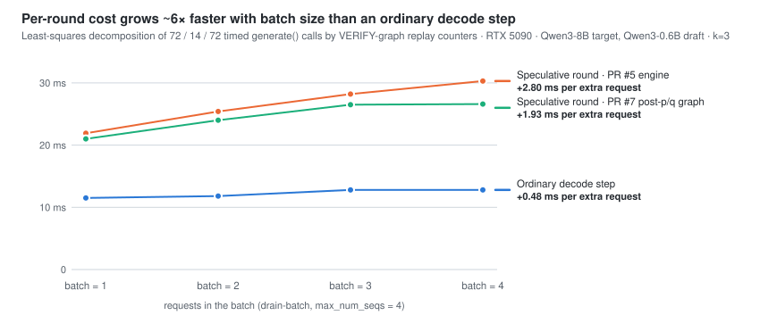

# nano-vllm-speculative-decoding

Speculative decoding on a minimal vLLM fork: an implementation, a 230-run
benchmark on one RTX 5090, and a decomposition of why it only broke even.

[](https://github.com/tianyuantong/nano-vllm-speculative-decoding/actions/workflows/cpu-tests.yml)
[](LICENSE)

Fork of [nano-vLLM](https://github.com/GeeeekExplorer/nano-vllm) (≈1,400 lines
of Python: paged KV cache, CUDA-graph decode, FlashAttention). Six pull
requests add an offline speculative-decoding engine and measure it against
ordinary decoding with Qwen3-8B as the target and Qwen3-0.6B as the draft.
Experiments are frozen at commit `85f91bd`; this README and
[docs/PERFORMANCE.md](docs/PERFORMANCE.md) are the write-up.

## Result

<picture>
  <source media="(prefers-color-scheme: dark)" srcset="docs/assets/round-cost-dark.svg">
  
</picture>

| Configuration (k = draft length) | Tokens per round | Round ÷ ordinary step (batch 4) | Net vs. ordinary decoding |
|---|---:|---:|---|
| Random speculation, k=3 (PR #5 engine) | 2.27 | 2.37 | −2.7 % on 48 requests × 3 seeds |
| Random speculation, k=3 + verification-block graph (PR #7) | 2.11 | 2.08 | +5.4 % on 24 requests, −8.6 % on the stress group |
| Greedy speculation, k=4 (PR #7) | 2.36 | 2.01 | +12.7 % on 24 requests, ±0 on the stress group |

Speculative decoding wins only when *tokens per round* exceeds *round cost ÷
step cost*; every configuration measured sits within a few percent of that
line, which is why the sign flips between workloads.

**Why the round is expensive.** A least-squares decomposition of the archived
timings by batch size shows a speculative round costs a fixed ≈20 ms
(target verify 11 ms + draft steps ≈5 ms + host syncs and Python ≈4 ms) plus
**2.8 ms per request** — six times the 0.48 ms per request of an ordinary
step. The per-request part is CPU dispatch: the sampler runs per request in
Python (≈225 small tensor ops per request per round) because every request
owns its own RNG streams, and two host synchronizations per round stop that
work from overlapping the GPU. At batch 4 it equals one full 8B forward.
PR #7 confirms the diagnosis by removing part of it (2.91 → 1.93 → 1.34 ms per
request); the fixed 20 ms is untouched by any PR. Details, the inequality and
the remaining fixes: [docs/PERFORMANCE.md](docs/PERFORMANCE.md).

## What was built

| PR | Summary |
|---|---|
| [#2](https://github.com/tianyuantong/nano-vllm-speculative-decoding/pull/2) | `temperature=0` greedy decoding and an `enable_prefix_cache` switch |
| [#3](https://github.com/tianyuantong/nano-vllm-speculative-decoding/pull/3) | Offline randomized speculative decoding: draft-model and n-gram proposals, acceptance/residual sampling, per-request RNG streams, separate target/draft KV caches |
| [#4](https://github.com/tianyuantong/nano-vllm-speculative-decoding/pull/4) | CUDA graphs for the multi-position verification forward, KV-only draft forwards; dual-model time −44 % |
| [#5](https://github.com/tianyuantong/nano-vllm-speculative-decoding/pull/5) | Opt-in sampling fast paths; k selection — k=3 was 4.5 % faster than ordinary on 8 requests |
| [#6](https://github.com/tianyuantong/nano-vllm-speculative-decoding/pull/6) | Expanded retest on 48 requests × 3 seeds: the advantage did not hold (−2.7 %) |
| [#7](https://github.com/tianyuantong/nano-vllm-speculative-decoding/pull/7) | Greedy speculation and a CUDA graph for the post-p/q verification block |

Each PR is one commit with its own results table and validation notes in the
description. Raw timings, inputs and outputs are attached to the
[releases](https://github.com/tianyuantong/nano-vllm-speculative-decoding/releases).

## Repository map

| Path | Contents |
|---|---|
| `nanovllm/engine/random_decode.py` | offline controller: rounds, KV bookkeeping, commit and rollback |
| `nanovllm/engine/random_backend.py`, `greedy_backend.py` | proposal, verification and sampling for random / greedy modes |
| `nanovllm/layers/random_sampler.py` | acceptance, residual and exponential-race draw primitives |
| `nanovllm/engine/verify_graph.py`, `verify_sampling.py` | CUDA-graph capture of the verification forward and of the post-p/q block |
| `nanovllm/engine/model_runner.py` | upstream runner plus `run_queries` for multi-token verification |
| `docs/PERFORMANCE.md` | the analysis |
| `docs/DECODING.md` | usage and configuration of `RandomLLM` |
| `docs/GLOSSARY.md` | the mode, stage and switch codes used in PRs and reports |
| `tools/decompose_timings.py` | recomputes the decomposition tables from a release archive |
| `tools/*_gpu_gate.py` | the GPU measurement scripts behind each PR |
| `tests/` | CPU control-flow and reference checks (run in CI) and GPU acceptance scripts |

## Reproduce

CPU checks (what CI runs; no GPU, flash-attn or triton needed):

```bash
pip install torch --index-url https://download.pytorch.org/whl/cpu
pip install "transformers>=4.51" xxhash numpy pytest
python tools/run_cpu_tests.py
python -m pytest -q tests/perf_repair
```

The decomposition tables, from an unpacked release archive:

```bash
python tools/decompose_timings.py expanded-k3-evidence/evidence/clean
```

GPU measurements need a CUDA machine with the two models; the commands and
configuration are in [docs/DECODING.md](docs/DECODING.md).

## Provenance

Forked from [GeeeekExplorer/nano-vllm](https://github.com/GeeeekExplorer/nano-vllm)
at `bb823b3` ([docs/UPSTREAM.md](docs/UPSTREAM.md)). The upstream MIT license
is retained.
