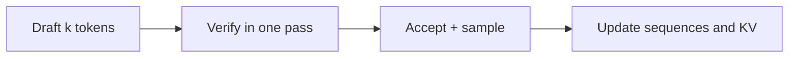

<div align="center">

# nano-vllm-speculative-decoding

Batched speculative decoding for [nano-vLLM](https://github.com/GeeeekExplorer/nano-vllm).

**1.50× throughput at batch 1 · 1.17× at batch 8**

[](https://github.com/tianyuantong/nano-vllm-speculative-decoding/actions/workflows/cpu-tests.yml)


[](LICENSE)

**English** | [简体中文](README.zh.md) · [Quick start](#usage) · [Performance](docs/RESULTS.md) · [Design](docs/design/batched-speculative-decoding.md)

<picture>
  <source media="(prefers-color-scheme: dark)" srcset="docs/assets/speedup-dark.svg">
  
</picture>

</div>

Qwen3-8B + Qwen3-0.6B · BF16 · RTX PRO 6000 Blackwell. Compared with ordinary decoding in the same
engine, throughput rises from **81.4 to 122.0 tokens/s** at batch 1 and **507.7 to 592.8 tokens/s** at batch 8.
[Full results and reproduction →](docs/RESULTS.md)

## Highlights

A small draft model proposes several tokens; the target model checks them in one forward pass.
This project brings that process into nano-vLLM's decoding loop, combining batched sampling,
CUDA Graphs and the existing scheduler.

- **Batched GPU sampling.** Proposal probabilities and acceptance stay on the GPU. A vectorized sampler
  handles the whole batch, and each round copies its results to the CPU once.
  [Sampler implementation →](nanovllm/layers/spec_sampler.py)
- **CUDA Graph verification.** Fixed-length drafts and padded batches let verification reuse captured
  CUDA Graphs across rounds. The target scores all draft positions in one forward pass.
  [Decoding implementation →](nanovllm/engine/speculative.py)
- **Integrated scheduling and KV management.** The scheduler reserves space for both models and tracks
  their KV states as tokens are accepted, requests finish and new requests join the batch.
  [Scheduler implementation →](nanovllm/engine/scheduler.py)



## Usage

Python 3.10–3.12 and a CUDA GPU with room for both models and their KV caches.

```bash
git clone https://github.com/tianyuantong/nano-vllm-speculative-decoding.git
cd nano-vllm-speculative-decoding
pip install torch triton flash-attn "transformers>=4.51" xxhash
python -m pip install -e . --no-deps
```

Set the local model paths and generate:

```python
from nanovllm import LLM, SamplingParams

llm = LLM(
    "/models/Qwen3-8B",
    draft_model="/models/Qwen3-0.6B",
    num_speculative_tokens=3,
    max_num_seqs=8,
    enable_prefix_cache=False,
    kv_cache_memory_bytes=10 << 30,
    draft_kv_cache_memory_bytes=6 << 30,
    seed=0,
)
params = SamplingParams(temperature=0.7, top_k=20, top_p=0.8, max_tokens=256)

try:
    outputs = llm.generate(["Explain KV caching."], params)
    print(outputs[0]["text"])
finally:
    llm.exit()
```

Use ordinary decoding by omitting `draft_model` and `num_speculative_tokens`.
[Model configuration and API →](docs/DECODING.md)

## Explore the project

| Document | What's inside |
|---|---|
| [Performance](docs/RESULTS.md) | Batch-size comparisons, phase timings, output comparisons and reproduction commands |
| [Design](docs/design/batched-speculative-decoding.md) | Draft/target execution, KV state, batching and CUDA Graphs |
| [Usage guide](docs/DECODING.md) | Model configuration, sampling options and timing API |
| [Optimization history](docs/PERFORMANCE.md) | Profiling the first implementation and the bottlenecks behind the rewrite |

CPU tests run in [GitHub Actions](.github/workflows/cpu-tests.yml). Benchmarking starts with
[`bench_spec.py`](bench_spec.py); [`tools/plot_results.py`](tools/plot_results.py) builds the performance figures.

## Acknowledgments

Built on [GeeeekExplorer/nano-vllm](https://github.com/GeeeekExplorer/nano-vllm), with
[Qwen3](https://huggingface.co/Qwen/Qwen3-8B), [FlashAttention](https://github.com/Dao-AILab/flash-attention)
and [Triton](https://github.com/triton-lang/triton). The sampling algorithm follows Leviathan et al.,
*Fast Inference from Transformers via Speculative Decoding* (2023), and Chen et al.,
*Accelerating Large Language Model Decoding with Speculative Sampling* (2023).
[Upstream history →](docs/UPSTREAM.md)

## License

[MIT](LICENSE).
