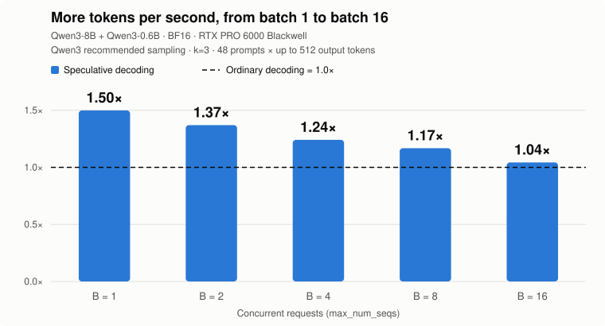
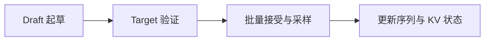

<div align="center">

# nano-vllm-speculative-decoding

为 [nano-vLLM](https://github.com/GeeeekExplorer/nano-vllm) 实现批量投机解码。

**B=1 吞吐提升至 1.50 倍 · B=8 提升至 1.17 倍**

[](https://github.com/tianyuantong/nano-vllm-speculative-decoding/actions/workflows/cpu-tests.yml)


[](LICENSE)

[English](README.md) | **简体中文** · [快速开始](#快速开始) · [性能结果](docs/RESULTS.md) · [实现设计](docs/design/batched-speculative-decoding.md)

<picture>
  <source media="(prefers-color-scheme: dark)" srcset="docs/assets/speedup-dark.svg">
  
</picture>

</div>

Qwen3-8B + Qwen3-0.6B · BF16 · RTX PRO 6000 Blackwell。相较同一引擎的普通解码，
B=1 的吞吐从 **81.4 提升到 122.0 tokens/s**，B=8 从 **507.7 提升到 592.8 tokens/s**。
[完整性能结果与复现 →](docs/RESULTS.md)

## 核心改进

小模型每轮起草多个 token，大模型通过一次前向计算完成验证。本项目把这套流程接入 nano-vLLM 的解码循环，
结合批量采样、CUDA Graph 和原有调度器，提高生成吞吐。

- **GPU 批量采样。** 候选 token 的概率与接受判定都留在 GPU 上，用向量化算子处理整批请求，每轮统一回传一次结果。
  [采样器实现 →](nanovllm/layers/spec_sampler.py)
- **CUDA Graph 验证。** 固定每轮 draft 长度，按 batch size 补齐形状，跨轮复用 CUDA Graph；target 一次前向计算所有候选位置。
  [解码流程实现 →](nanovllm/engine/speculative.py)
- **调度与 KV 管理。** 调度器为两个模型预留缓存空间，随 token 接受、请求完成和新请求加入，维护各自的 KV 状态。
  [调度器实现 →](nanovllm/engine/scheduler.py)



## 快速开始

使用 Python 3.10–3.12 和 CUDA GPU，显存需容纳两个模型及其 KV cache。

```bash
git clone https://github.com/tianyuantong/nano-vllm-speculative-decoding.git
cd nano-vllm-speculative-decoding
pip install torch triton flash-attn "transformers>=4.51" xxhash
python -m pip install -e . --no-deps
```

填入本地模型路径即可生成：

```python
from nanovllm import LLM, SamplingParams

llm = LLM(
    "/models/Qwen3-8B",
    draft_model="/models/Qwen3-0.6B",
    num_speculative_tokens=3,
    max_num_seqs=8,
    enable_prefix_cache=False,
    kv_cache_memory_bytes=10 << 30,
    draft_kv_cache_memory_bytes=6 << 30,
    seed=0,
)
params = SamplingParams(temperature=0.7, top_k=20, top_p=0.8, max_tokens=256)

try:
    outputs = llm.generate(["Explain KV caching."], params)
    print(outputs[0]["text"])
finally:
    llm.exit()
```

省略 `draft_model` 和 `num_speculative_tokens` 即可使用普通解码。
[模型配置与 API →](docs/DECODING.md)

## 深入了解

| 文档 | 内容 |
|---|---|
| [性能结果](docs/RESULTS.md) | 不同 batch size 的性能、阶段耗时、输出对比与复现命令 |
| [实现设计](docs/design/batched-speculative-decoding.md) | 双模型执行、KV 状态、批处理与 CUDA Graph |
| [使用指南](docs/DECODING.md) | 模型配置、采样参数与计时 API |
| [优化历程](docs/PERFORMANCE.md) | 第一版的性能分析，以及推动本次重写的主要瓶颈 |

CPU 测试通过 [GitHub Actions](.github/workflows/cpu-tests.yml) 运行。
性能测试入口是 [`bench_spec.py`](bench_spec.py)，图表由 [`tools/plot_results.py`](tools/plot_results.py) 生成。

## 致谢

基于 [GeeeekExplorer/nano-vllm](https://github.com/GeeeekExplorer/nano-vllm) 构建，使用
[Qwen3](https://huggingface.co/Qwen/Qwen3-8B)、[FlashAttention](https://github.com/Dao-AILab/flash-attention)
与 [Triton](https://github.com/triton-lang/triton)。采样算法参考 Leviathan 等人的
*Fast Inference from Transformers via Speculative Decoding*（2023）和 Chen 等人的
*Accelerating Large Language Model Decoding with Speculative Sampling*（2023）。
[上游版本与项目历史 →](docs/UPSTREAM.md)

## 许可

[MIT](LICENSE)。
