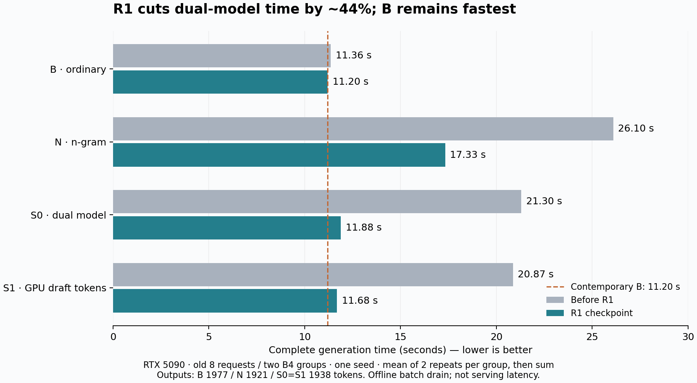

# R1：随机投机解码阶段基线

2026-09-14。R1把S0/S1完整生成耗时减少约44%，但普通解码B仍最快。这是可复现的工程阶段成果，不是最终性能结论。



图中虚线是同期修复后的普通解码B。灰色为修复前，蓝色为R1；多项改动一起测试，不能把全部收益归因于某一项。图由[原始32次计时](timings.csv)、[汇总](summary.json)与[绘图脚本](plot.py)支持，不是模拟的逐token播放效果。

## 比较条件与结果

RTX5090，Qwen3-8B target + Qwen3-0.6B draft，BF16/TP1，Torch2.9.1+cu130、Triton3.5.1、FlashAttention2.8.3。标准随机采样T=1，无top-k/top-p/惩罚；seed17011，自然EOS151645，输出上限512。prefix cache关闭，target KV4GiB/113块、draft1.5GiB/54块，max_model_len3328、max_num_batched_tokens5328。

旧开发集8条请求分两组，每组4条同时进入，全部结束后再进入下一组，不补入请求。四组合、修复前后各独立进程，共16进程。完整同seed预热后各计时2次，共32次。计时含prefill、draft、补算、验证、采样、同步和返回，排除加载/预热；每组重复先取平均，再汇总两组。这里是离线B4排空时间，不是单请求或线上服务延迟。

| 组合 | 修复前秒 | R1秒 | 相对自身修复前速度 | R1实际token/s | 输出token数 |
|---|---:|---:|---:|---:|---:|
| B 普通随机解码 | 11.3601 | 11.1995 | 1.014倍 | 176.526 | 1977 |
| N n-gram | 26.0976 | 17.3303 | 1.506倍 | 110.846 | 1921 |
| S0 双模型 | 21.2985 | 11.8848 | 1.792倍 | 163.066 | 1938 |
| S1 GPU续接草稿 | 20.8712 | 11.6837 | 1.786倍 | 165.872 | 1938 |

S0、S1分别减少44.20%、44.02%耗时，但比R1同期B仍多6.12%、4.32%。S1输出比B少39枚，实际吞吐仍低约6.04%；不能把“比旧S1快1.786倍”写成“比普通解码快1.786倍”。S1相对S0耗时减少约1.69%，只报告净路径差异，不归因纯PCIe带宽或传输时间。

同组合修复前后、同版本S0/S1的输出、停止及角色随机数状态一致。B和投机组合之间不要求随机文本一致。R1的B/N/S0/S1两次全组时间汇总相对差分别0.0236%/0.1824%/0.0316%/0.0141%；全部条件最大单组重复差约0.545%。只有一个seed和两个开发组，不能作显著性、普遍性或质量保证。

## 实现与验收

本PR包含此前尚未提交的标准随机双模型实现，以及R1优化：多位置验证Graph（B1–4、q2–5共16形状）、draft仅补KV时跳过无用LM head、检查未缓存后缀而非反复扫描完整历史、合并提交边界返回、减少概率临时数组。FP32 p/q、FP64 mass/accept/residual、真实draft补算、角色RNG及错误检查保留。混合query长度走规定eager回退，计时前冻结Graph缓存。

- CPU81项通过；GPU作业内CPU/CUDA104项通过。
- 最终compact GPU采样函数12类小词表频率检查，每类100,000次，通过；不是CPU替代路径。
- 16种形状全部实际捕获，另4个长输入/块变化与1个混合长度回退，共21个门禁用例通过；检查logits、选定KV块字节、结果生命周期、短生成和回收。
- 32次计时通过；同组合修复前后与S0/S1的输出/停止/RNG一致；计时段没有新增Graph捕获，编译计数器不变。
- 本轮双模型`recompile_limit`警告发生在预热阶段；不证明不存在持久回退。
- 作业153577完成、退出码0、占GPU13分30秒，离队且退出GPU计算进程为空。73文件执行绑定不变，61份下载结果SHA一致。[验收索引和原始文件哈希](validation.json)。完整原始输出/日志保留在实验归档，本PR公开精简计时与校验摘要，不声称归档文件都已公开。

此前153525/153535失败分别占56/27秒：第16个Graph被进程reserved增长预算挡住。当时GPU仍空闲6.693GiB，reserved增长2.023GiB超2GiB限制，不是已证实OOM。修正把验收KV快照移到CPU，并在捕获准入受阻时允许一次释放空闲缓存后按原阈值复查。最终GPU未触发缓存回收分支，该分支有CPU回归；不能说本轮GPU实际触发验证了它。

**严格保持普通B实际有限精度分布仍未解决，任务质量未评估。**旧64条件中2个数值调查触发点不因本次通过而改判。有限同轨迹检查也不能证明所有输入分布相等。未测线上负载、P99、能耗或成本。

## 如何作为下一轮基线

R1是下一轮的代码/工程基线：以此PR的完整提交SHA和[28份引擎SHA256](engine-sha256.json)定位，使用相同模型、环境和已记录输入配置。不要只记录旧HEAD7977c30，那不包含本次未提交实现。

下一轮分别比较“新版本相对R1改善多少”与“新版本是否超过同期普通B”。本页11.1995秒只是历史观测，不能直接当下一轮的固定分母；共享优化也可能改善B，必须同期重测。完整生成时间为主指标，实际输出数、token/s及重复波动一起报告。开发8条可回归，但已看过的数据不能重新声称盲测；正式确认需事先冻结方案。

## 复现入口

使用兼容的现有环境与模型，参见仓库根目录`PERFORMANCE_REPAIR.md`及`tools/perf_repair_job.sbatch`。CPU与GPU检查分开执行；缺CUDA不算GPU通过。

```bash
python -m pytest -q tests/perf_repair
python tests/test_random_gpu.py --compact --result /new/results/compact-frequency.json
```

`tools/perf_repair_compare.py`需要修复前27份源码用于同期对照。本PR的倒数第二个提交保存该源码快照，最终提交保存R1；合并或rebase后请以PR原提交SHA定位，不能再假定`HEAD^`。

```bash
# 在本PR原始分支末端，临时导出少量参考源码；不复制环境或模型。
reference_dir=$(mktemp -d)
git archive HEAD^ nanovllm | tar -x -C "$reference_dir"
export REFERENCE_ROOT="$reference_dir"
export FROZEN_DEBUG_INPUTS="$PWD/docs/experiments/r1-20260914/frozen-debug8-r1.json"
# 配置TARGET_MODEL、DRAFT_MODEL、REPAIR_RESULTS为已有模型和全新结果目录。
# 激活兼容环境，从仓库根目录按站点参数提交tools/perf_repair_job.sbatch。
```

冻结输入文件与稳定request ID已附；不得重编码、截断、改题或覆盖旧结果。输出上限不是实际输出量。复现会有硬件/软件噪声，不能要求秒数逐位一致。
